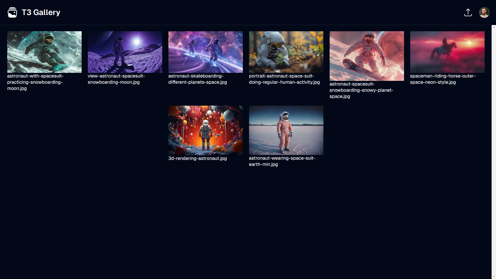
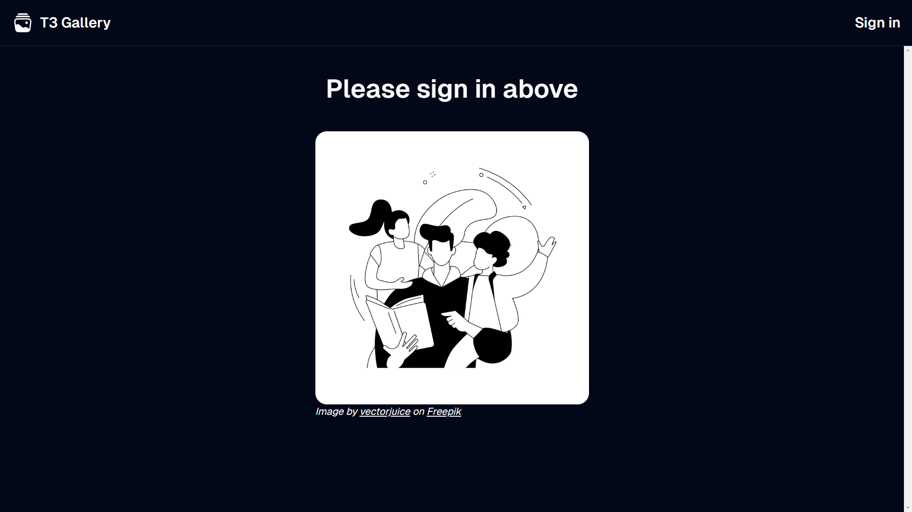
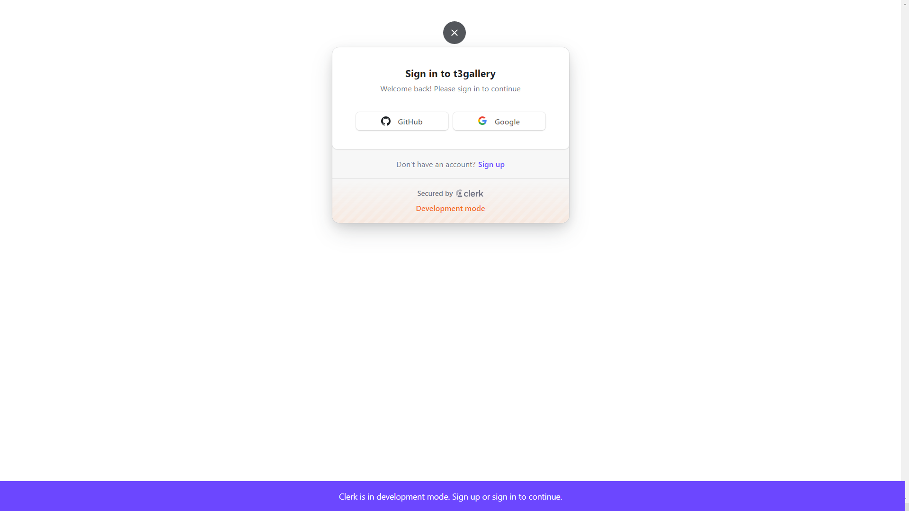
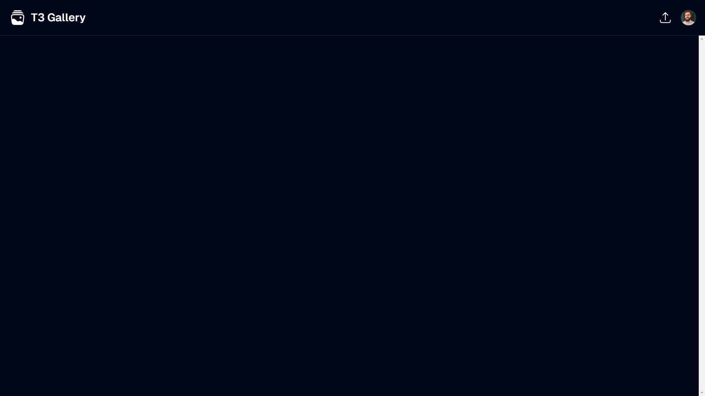
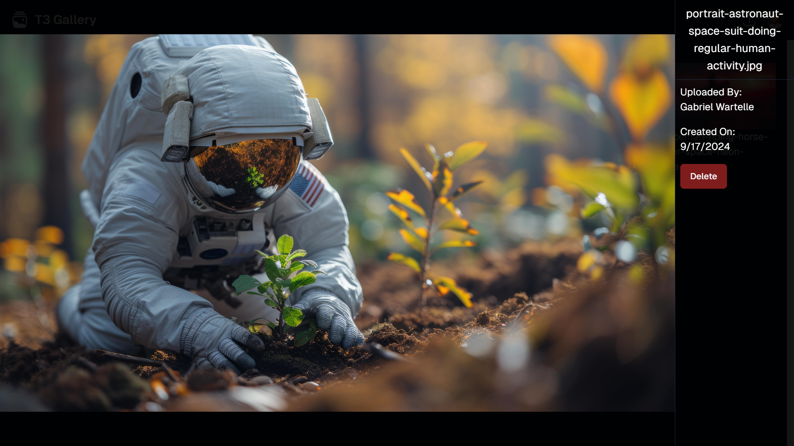
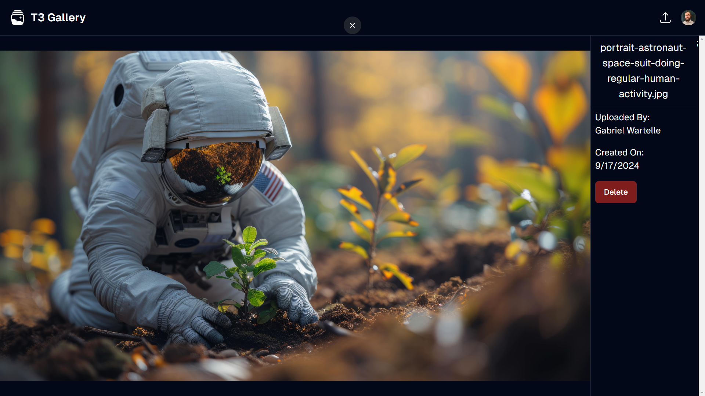

<a id="readme-top"></a>

<!--
*** This README is built upon the Best-README-Template, created by Othneil Drew.
*** If you wish to use this template, go check his repository :
*** https://github.com/othneildrew/Best-README-Template/tree/master
*** And don't forget to give his project a star!
-->

<!-- PROJECT TITLE -->

<div align="center">
  <a href="https://t3gallery-gold-beta.vercel.app/" target="_blank" rel="noopener noreferrer">
    
  </a>
</div>
<h1 align="center">T3 Gallery</h1>

<!-- TABLE OF CONTENTS -->

<details>
  <summary>Table of Contents</summary>
  <ol>
    <li>
      <a href="#about-the-project">About The Project</a>
      <ul>
        <li><a href="#built-with">Built With</a></li>
      </ul>
    </li>
    <li>
      <a href="#folder-structure">Folder Structure</a>
      <ul>
        <li><a href="#root">Root folder</a></li>
        <li><a href="#src">Src folder</a></li>
        <li><a href="#app">App folder</a></li>
      </ul>
    </li>
    <li>
      <a href="#cloning-the-project">Cloning the project</a>
      <ul>
        <li><a href="#prerequisites">Prerequisites</a></li>
        <li><a href="#running">Running the project</a></li>
      </ul>
    </li>
    <li><a href="#usage">Usage</a></li>
    <li><a href="#improvements">Improvements</a></li>
    <li><a href="#contact">Contact</a></li>
    <li><a href="#acknowledgments">Acknowledgments</a></li>
  </ol>
</details>

<!-- ABOUT THE PROJECT -->

<h2 id="about-the-project">About The Project</h2>



If you want to take a direct look at this project, you can do so right [here](https://t3gallery-gold-beta.vercel.app/).

This project was built following this [tutorial](https://www.youtube.com/watch?v=d5x0JCZbAJs).

T3 Gallery is a photo gallery web app, built using the [T3](https://create.t3.gg/) stack, using [TypeScript](https://www.typescriptlang.org/), [Next.js](https://nextjs.org/), [React](https://react.dev/) and [Node.js](https://nodejs.org/en). It allows you to upload and store images in a personal online gallery.

It uses [Clerk](https://clerk.com/) for the authentication, [PostgreSQL](https://www.postgresql.org/) for the database, [Drizzle](https://orm.drizzle.team/) as ORM, and [UploadThing](https://uploadthing.com/) for uploading and storing images.
T3 Gallery also uses [Sentry](https://sentry.io/welcome/) for error management, [PostHog](https://posthog.com/) for analytics, and [Upstash](https://upstash.com/) for rate limiting.
Finally the styling is done using [TailwindCSS](https://tailwindcss.com/) and some components of the [ShadcnUI](https://ui.shadcn.com/) library.

This project is deployed on [Vercel](https://vercel.com/).

<p align="right">(<a href="#readme-top">back to top</a>)</p>

<h3 id="built-with">Built With</h3>

- Tech stack :

[](https://nextjs.org/)
[](https://react.dev/)
[](https://nodejs.org/en)
[](https://www.postgresql.org/)

- Tools :

[](https://vercel.com/)
[](https://tailwindcss.com/)
[](https://ui.shadcn.com/)
[](https://clerk.com/)
[](https://orm.drizzle.team/)
[](https://sentry.io/welcome/)
[](https://posthog.com/)
[](https://upstash.com/)

<p align="right">(<a href="#readme-top">back to top</a>)</p>

<!-- FOLDER STRUCTURE -->

<h2 id="folder-structure">Folder Structure</h2>

<h3 id="root">Root folder</h3>

In the root folder, we find some classic files: `README.md`, `.gitignore`, `package.json`, and `.env.example` used as a base to set up the `.env` file for replicating this project.

The rest of the files are mainly configuration files.

We also find the `public/` folder with the images used for this project, and the `src/` folder with the main content of the app.

<h3 id="src">Src folder</h3>

The `src/` folder is divided in several folder :

`app/` for the main part of the frontend, `common/` and `components/` for reusable elements in the app, `hooks/` for the hook used for toasts, `lib/` with a tool for merging CSS classes, `server/` which sets up the database connection and the rate limiting configuration, `styles/` with the global styles applied to the app, and `utils/` with the file that sets up the connection to [UploadThing](https://uploadthing.com/).

<h3 id="app">App folder</h3>

The `app/` folder has the main parts of the frontend :

The `layout.tsx` file sets up the core layout of the app, and the `page.tsx` file defines the main content displayed on the landing page and the home page.
The `global-error.tsx` file handles the error management with [Sentry](https://sentry.io/welcome/).

For the folders in `app/`, we have :

`_analytics/` with the configuration for [PostHog](https://posthog.com/), `_components/` with the different components used on the frontend, `@modal/` which defines the modal used for displaying images fullscreen, `api/` which defines the connection to the server, and `img/` which is used for parallel routing.

<p align="right">(<a href="#readme-top">back to top</a>)</p>

<!-- CLONING THE PROJECT -->

<h2 id="cloning-the-project">Cloning the project</h2>

<h3 id="prerequisites">Prerequisites</h3>

If you want to clone this project, you must have [Node.js](https://nodejs.org/en) installed, as well as [Git](https://git-scm.com/downloads).

1. To clone this project, first go in the directory you want to install the project in :

   ```sh
   cd path/to/your/directory
   ```

2. And then run this command to clone the project :

   ```sh
   git clone https://github.com/GWartelle/t3gallery.git
   ```

<h3 id="running">Running the project</h3>

1. In the root of the project, start by running the command `npm install` to install all the packages :

   ```sh
   npm install
   ```

2. Next, in the editor of your choice, open the `.env.example` file. For example, using VSCode, you can run this command :

   ```sh
   code .env.example
   ```

3. Update the environment variables with your own :

   ```py
   # Vercel
   POSTGRES_URL = "postgres_url...";
   POSTGRES_PRISMA_URL = "postgres_prisma_url...";
   POSTGRES_URL_NO_SSL = "postgres_url_no_ssl...";
   POSTGRES_URL_NON_POOLING = "postgres_url_non_pooling...";
   POSTGRES_USER = "postgres_user...";
   POSTGRES_HOST = "postgres_host...";
   POSTGRES_PASSWORD = "postgres_password...";
   POSTGRES_DATABASE = "postgres_database...";
   # Clerk
   NEXT_PUBLIC_CLERK_PUBLISHABLE_KEY = "next_public_clerk_publishable_key...";
   CLERK_SECRET_KEY = "clerk_secret_key...";
   # UploadThing
   UPLOADTHING_SECRET = "uploadthing_secret...";
   UPLOADTHING_APP_ID = "uploadthing_app_id...";
   # Sentry
   SENTRY_AUTH_TOKEN = "sentry_auth_token...";
   # PostHog
   NEXT_PUBLIC_POSTHOG_KEY = "next_public_posthog_key...";
   NEXT_PUBLIC_POSTHOG_HOST = "next_public_posthog_host...";
   # Upstash
   UPSTASH_REDIS_REST_URL = "upstash_redis_rest_url...";
   UPSTASH_REDIS_REST_TOKEN = "upstash_redis_rest_token...";
   ```

This is quite a lot of environmental variables, but all the services that they are used for are free and easy to use.

You can find all these variables when you create a new project respectively on [Vercel](https://vercel.com/), [Clerk](https://clerk.com/), [UploadThing](https://uploadthing.com/), [Sentry](https://sentry.io/welcome/), [PostHog](https://posthog.com/) and [Upstash](https://upstash.com/).

4. Once it's done, change the name of the file to `.env` :

   ```sh
   mv .env.example .env
   ```

5. Lastly, to run the project, run this command :

   ```sh
   npm run dev
   ```

<p align="right">(<a href="#readme-top">back to top</a>)</p>

<!-- USAGE EXAMPLES -->

<h2 id="usage">Usage</h2>



When you first visit the [T3 Gallery](https://t3gallery-gold-beta.vercel.app/) website, you find yourself on the landing page.
Here you are invited to sign in, by clicking on `Sign in` in the top-right corner of the screen.



Here you will have the choice to sign in either with your [GitHub](https://github.com/) account or your [Google](https://www.google.com/) account.
Once you've made your choice, the panel for choosing your GitHub/Google account appears and will ask you to confirm your connection to the T3 Gallery app.



Once signed in, you'll land on the home page.
On the top right corner, you can now see the profile picture of your GitHub/Google account.
If you click on it you can manage your account, or sign out.

The page is at first empty as you did not upload any images yet.
To do so you simply have to click on the upload icon to the left of your profile picture.
This will open up a file explorer window, allowing you to choose the image(s) you want to upload.
You are allowed to upload images with a maximum file size of 8MB, and up to 10 images at a time, with a limit of 10 images every 100 seconds.


Once you uploaded one or more image(s), the home page displays the thumbnail of your uploaded image(s), with its/their title underneath.
If you click on an image, this will open it in a modal on fullscreen.



On this modal page you have the image you clicked on displayed fullscreen.
You can also find, the title of the image on the right side, with the name of the user who uploaded it, and the date of the upload.
Underneath the date, there is a `Delete` button which allows you to delete the image.
If you were to reload the page, you'd be redirected to a parallel route, on a page specific to the image you were looking at, instead of going back to the home page.



On this page, you'll find exactly the same elements of the previous modal, plus the navigation bar.
If you want to go back to the home page, you can simply click on the logo of the T3 Gallery app on the top left of your screen.
And if you want to log out, you can do so by clicking on your profile picture on the top right, and by clicking `Sign out`.

That's all for T3 Gallery !

<p align="right">(<a href="#readme-top">back to top</a>)</p>

<!-- IMPROVEMENTS  -->

<h2 id="improvements">Improvements</h2>

As this project is primarily built for training purposes, it is rather light in terms of features.
Therefore, if I had more time on my hands to improve this web app, here are the features I would implement :

1. The most important point in my opinion, would be to add responsivity. This is a crucial feature for all modern web apps, and this project clearly lacks it.
2. It would also be a good thing to update the page layout to properly manage different image resolutions.
3. Next, I would add the possibility to create folders, or albums, allowing users to organize their gallery.
4. To go along with the previous point, I'd allow users to select multiple images for placing them in a folder/album, or for deleting them all in one go.
5. Finally, I would update the scrolling behaviour of the page, loading only the images that are displayed on screen, and loading the others only when the user scrolls down.

<p align="right">(<a href="#readme-top">back to top</a>)</p>

<!-- CONTACT -->

<h2 id="contact">Contact</h2>

If you want to see more of my work, I invite you to go check my [portfolio](https://gwartelle.github.io/MyPortfolio/).

You can also take a look at my other projects on my [github](https://github.com/GWartelle).

And if you'd like to get in touch with me, feel free to reach out on [LinkedIn](https://www.linkedin.com/in/gabriel-wartelle/).

<p align="right">(<a href="#readme-top">back to top</a>)</p>

<!-- ACKNOWLEDGMENTS -->

<h2 id="acknowledgments">Acknowledgments</h2>

As mentionned above, this project was made following this [tutorial](https://www.youtube.com/watch?v=d5x0JCZbAJs).
So I would like to thank its creator for his amazing work.
If you want to go check the github of his tutorial you can do so right [here](https://github.com/t3dotgg/t3gallery).
Feel free to give him a star, as his work was well structured and his explanations clear and useful.

And of course I would like to thank you for taking the time to read through all this !
I wish you the best 😁

Have a great day 😉

<p align="right">(<a href="#readme-top">back to top</a>)</p>
